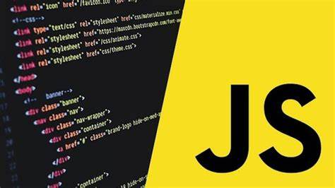

# Full Stack Javascript Bootcamp 2.0

## This lecture is for conditions, date and Math, Loops

**For rmore clarity on the javascript basic read index_script.js file**

>Loops => Do while, While, for


_Do while_
```javascript
let i=5;

do {
    console.log('value of i is :', i);
    i++;
} while (i<=8);
```

_While_
```Javascript
let j=8;

while (j<=12){
    console.log('value of j is', j);
    j++;
}
```

_For_
```javascript
 for (let i=2; i<=8; i++){
    console.log('value of i is ', i);
    console.log(i);
 }
```

[Click Here to see th full javascript basics](./index_script.js)


